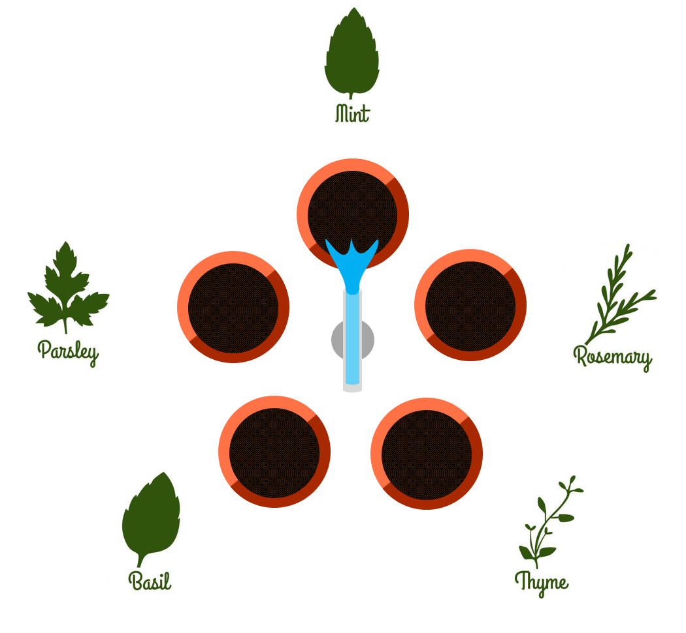
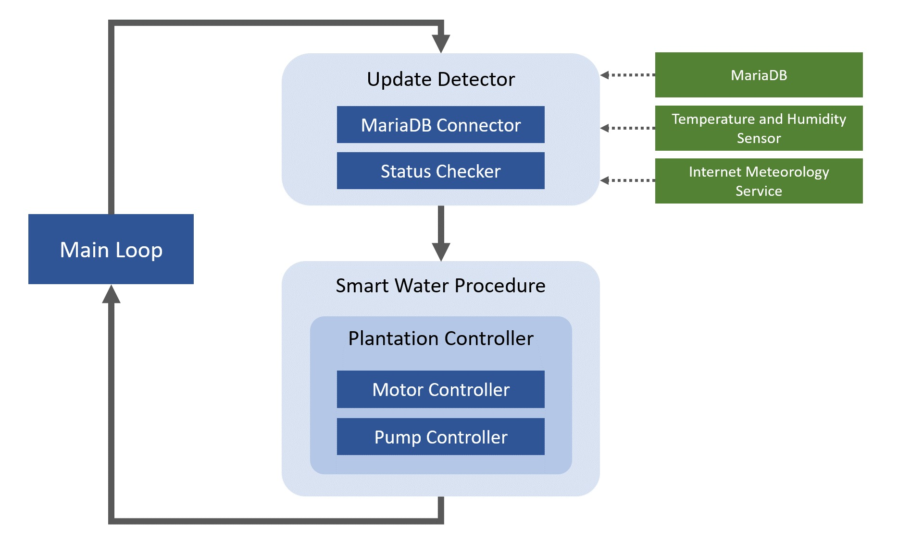
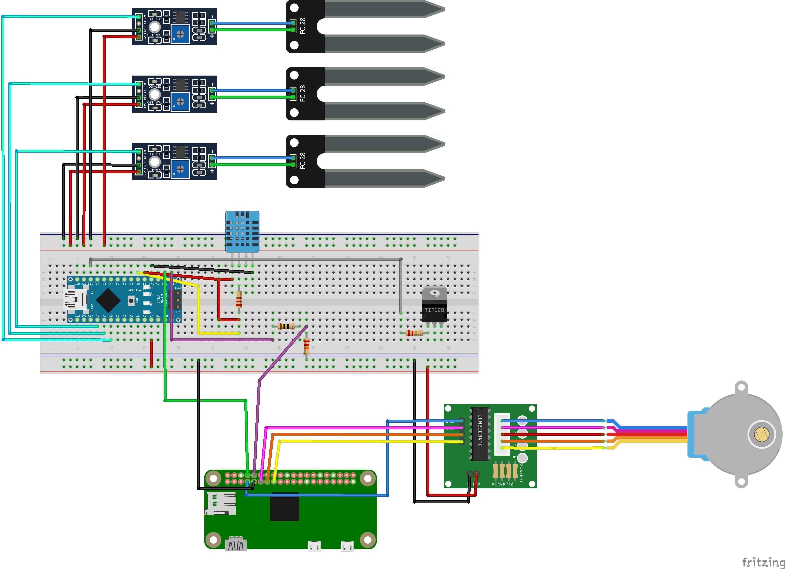

# Dragonfly Raspberry Pi 

This repository includes the Raspberry Pi client program that manages a dragonfly unit.

## What is Dragonfly?

Dragonfly is an intelligent domestic watering system that allows for an autonomous and efficient way of watering plants, by knowing what a plant needs and when it needs.

The system works by disposing plants in a circular pattern and the dragonfly watering unit on the center. A motor rotates the water pipe, allowing each plant to be watered individually. Each vase has its own humidity sensor and the system has a record of which plant is sowed on which vase.

 

 

This allows a custom watering regime for different plants. All plants are also registered in Dragonfly's databases, which allows the system to know what that plant's specific water and lighting requirements.

## The Watering Procedure

The watering procedure can be summed up by the following diagram:

 

 

## Wiring Circuit

 

 

## Running the Project

This client uses *Pi4j* which is a port of *WiringPi* for Java. Since *WiringPi* can only run on the Raspberry Pi's ARM architecture with GPIO, it is impossible to run the project without a Rasberry Pi.

In order to run the project in the Raspberry Pi, simply compile the project into a jar and execute it in the pi, either directly or remotely, through, *ssh*. Alternatively, the project can be compiled and the jar generated directly in the pi.